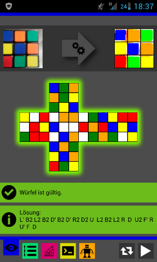

# Cube Solver App
Qt Mobile app able to capture and solve a Rubik's Cube using the [min2phase](https://github.com/cs0x7f/min2phase) algorithm. The solution can be sent to a solving robot via Bluetooth.

*\*\*Under Development\*\**

## Screenshot

